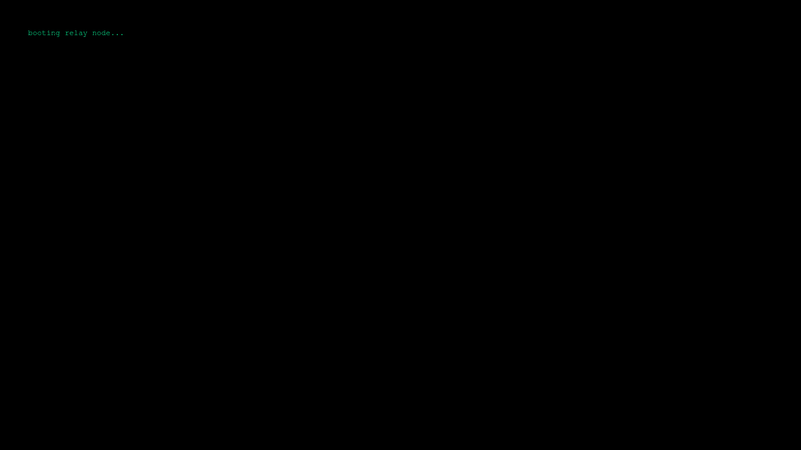

# RallyMean

> Not everything that averages… reveals.

An early signal-processing experiment.

---

## ▶️ Entry Points

Surface:
👉 https://rallymean.netlify.app

Deep:
👉 http://senpjoekkf4hlth6ej5lyqoizi62ois6u44zpd5vucuzo3w4sz4tw3qd.onion/rallymean/

---

## 🧩 What this is

A system that attempts to extract meaning from noise.

It doesn't always succeed.

---

## ⚠️ No instructions

If you're looking for a tutorial, you're already missing it.

---

## 👁️ Observations

- Patterns exist before they are understood  
- Input changes outcome  
- The system reacts  

---

## 🧠 Note

This was not the final form.

---

## 🎬 Preview

---

## 📌

Some experiments evolve.

Some get abandoned.

Some… continue elsewhere.